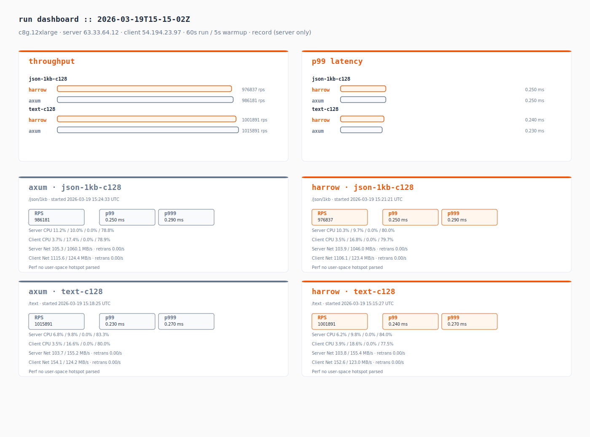
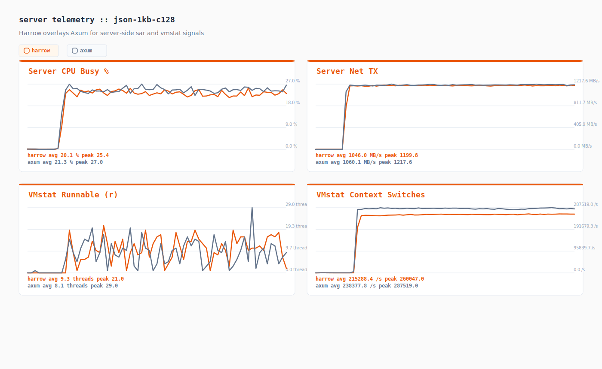
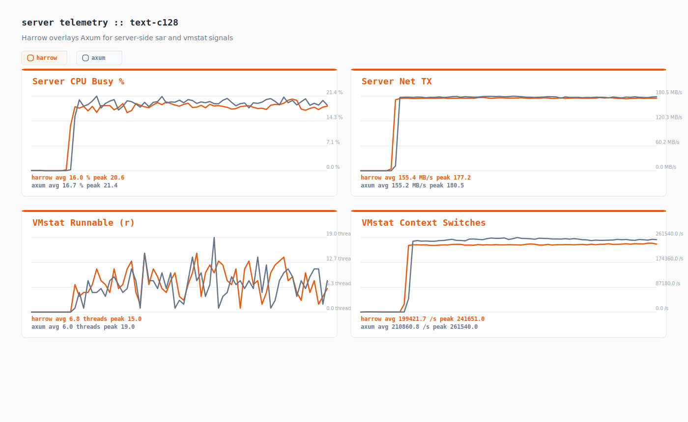
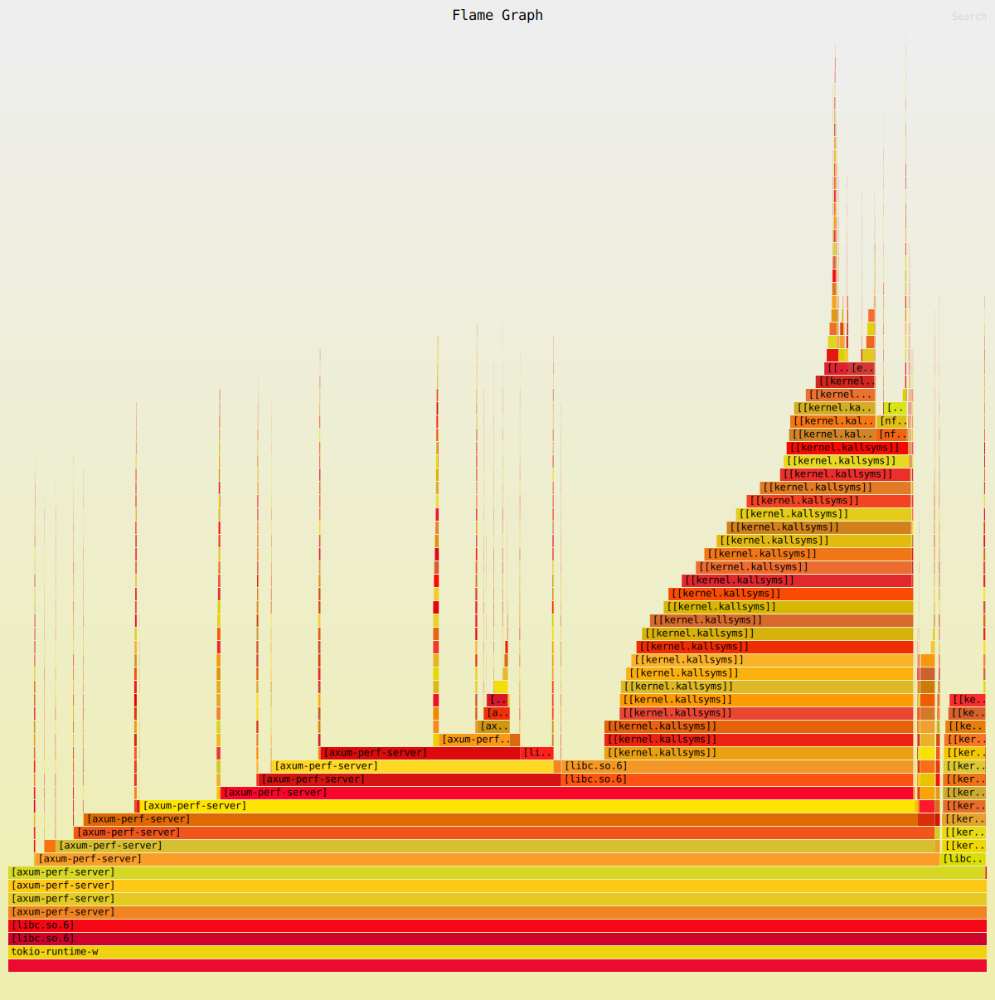
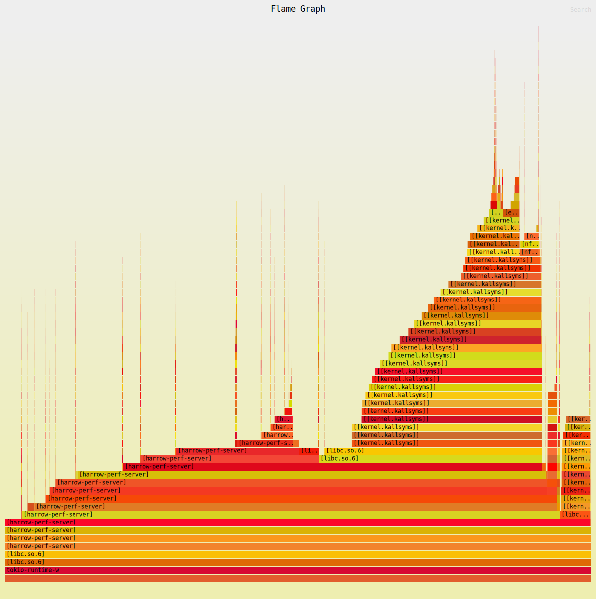
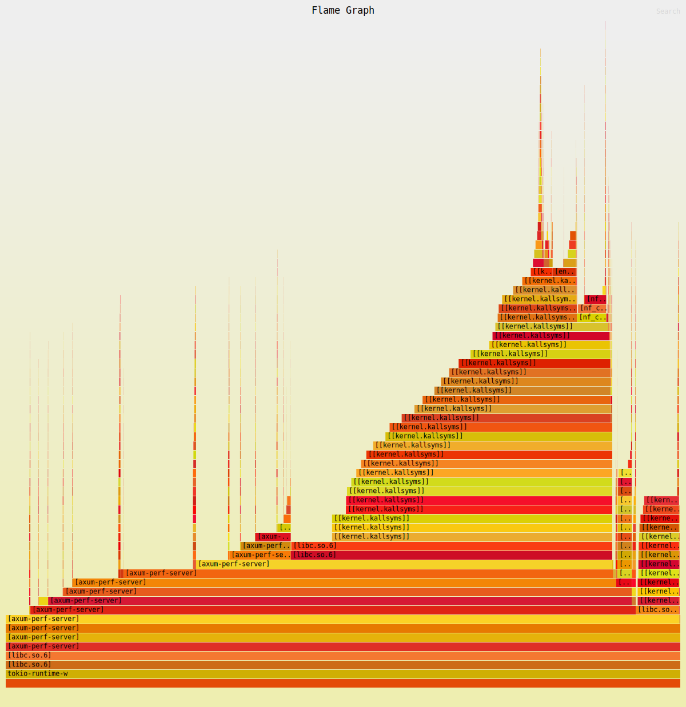
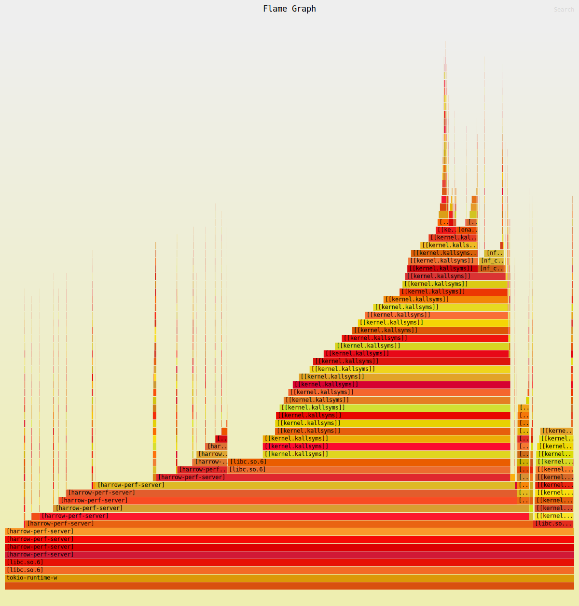

# Performance Test Results

Instance: c8g.12xlarge
Server: 63.33.64.12
Client: 54.194.23.97
Duration: 60s | Warmup: 5s
Spinr mode: docker
OS monitors: true
Perf: record (server only)
Date: 2026-03-19 15:25:39 UTC

## Runs

| Test case | Framework | Path | Concurrency | RPS | p50 (ms) | p99 (ms) | p999 (ms) |
|-----------|-----------|------|-------------|-----|----------|----------|-----------|
| json-1kb-c128 | axum | /json/1kb | 128 | 986180.880 | 0.120 | 0.250 | 0.290 |
| json-1kb-c128 | harrow | /json/1kb | 128 | 976837.250 | 0.130 | 0.250 | 0.290 |
| text-c128 | axum | /text | 128 | 1015890.700 | 0.120 | 0.230 | 0.270 |
| text-c128 | harrow | /text | 128 | 1001890.650 | 0.120 | 0.240 | 0.270 |

## Comparison

| Test case | Harrow RPS | Axum RPS | Delta % | Harrow p99 (ms) | Axum p99 (ms) |
|-----------|------------|----------|---------|------------------|---------------|
| json-1kb-c128 | 976837.250 | 986180.880 | -0.95% | 0.250 | 0.250 |
| text-c128 | 1001890.650 | 1015890.700 | -1.38% | 0.240 | 0.230 |

## Telemetry Digest

| Run | Server CPU (user/sys/wait/idle) | Client CPU (user/sys/wait/idle) | Server Net (rx/tx MB/s, retrans/s) | Client Net (rx/tx MB/s, retrans/s) | Top Perf Hotspot |
|-----|----------------------------------|----------------------------------|------------------------------------|------------------------------------|------------------|
| axum_json_1kb_c128 | 11.2% / 10.0% / 0.0% / 78.8% | 3.7% / 17.4% / 0.0% / 78.9% | 105.3 / 1060.1 MB/s · retrans 0.00/s | 1115.6 / 124.4 MB/s · retrans 0.00/s | - |
| harrow_json_1kb_c128 | 10.3% / 9.7% / 0.0% / 80.0% | 3.5% / 16.8% / 0.0% / 79.7% | 103.9 / 1046.0 MB/s · retrans 0.00/s | 1106.1 / 123.4 MB/s · retrans 0.00/s | - |
| axum_text_c128 | 6.8% / 9.8% / 0.0% / 83.3% | 3.5% / 16.6% / 0.0% / 80.0% | 103.7 / 155.2 MB/s · retrans 0.00/s | 154.1 / 124.2 MB/s · retrans 0.00/s | - |
| harrow_text_c128 | 6.2% / 9.8% / 0.0% / 84.0% | 3.9% / 18.6% / 0.0% / 77.5% | 103.8 / 155.4 MB/s · retrans 0.00/s | 152.6 / 123.0 MB/s · retrans 0.00/s | - |

## Telemetry Charts

### json-1kb-c128

### text-c128

## Artifacts

| Run | JSON | Perf Report | Perf Script | Perf SVG | Server CPU | Server Net | Client CPU | Client Net |
|-----|------|-------------|-------------|----------|------------|------------|------------|------------|
| axum_json_1kb_c128 | [json](./axum_json_1kb_c128.json) | [perf-report](./axum_json_1kb_c128.server.perf-report.txt) | [perf-script](./axum_json_1kb_c128.server.perf.script) | [perf.svg](./axum_json_1kb_c128.server.perf.svg) | [server cpu](./axum_json_1kb_c128.server.sar-u.txt) | [server net](./axum_json_1kb_c128.server.sar-net.txt) | [client cpu](./axum_json_1kb_c128.client.sar-u.txt) | [client net](./axum_json_1kb_c128.client.sar-net.txt) |
| harrow_json_1kb_c128 | [json](./harrow_json_1kb_c128.json) | [perf-report](./harrow_json_1kb_c128.server.perf-report.txt) | [perf-script](./harrow_json_1kb_c128.server.perf.script) | [perf.svg](./harrow_json_1kb_c128.server.perf.svg) | [server cpu](./harrow_json_1kb_c128.server.sar-u.txt) | [server net](./harrow_json_1kb_c128.server.sar-net.txt) | [client cpu](./harrow_json_1kb_c128.client.sar-u.txt) | [client net](./harrow_json_1kb_c128.client.sar-net.txt) |
| axum_text_c128 | [json](./axum_text_c128.json) | [perf-report](./axum_text_c128.server.perf-report.txt) | [perf-script](./axum_text_c128.server.perf.script) | [perf.svg](./axum_text_c128.server.perf.svg) | [server cpu](./axum_text_c128.server.sar-u.txt) | [server net](./axum_text_c128.server.sar-net.txt) | [client cpu](./axum_text_c128.client.sar-u.txt) | [client net](./axum_text_c128.client.sar-net.txt) |
| harrow_text_c128 | [json](./harrow_text_c128.json) | [perf-report](./harrow_text_c128.server.perf-report.txt) | [perf-script](./harrow_text_c128.server.perf.script) | [perf.svg](./harrow_text_c128.server.perf.svg) | [server cpu](./harrow_text_c128.server.sar-u.txt) | [server net](./harrow_text_c128.server.sar-net.txt) | [client cpu](./harrow_text_c128.client.sar-u.txt) | [client net](./harrow_text_c128.client.sar-net.txt) |

## Flamegraphs

### axum_json_1kb_c128

### harrow_json_1kb_c128

### axum_text_c128

### harrow_text_c128

