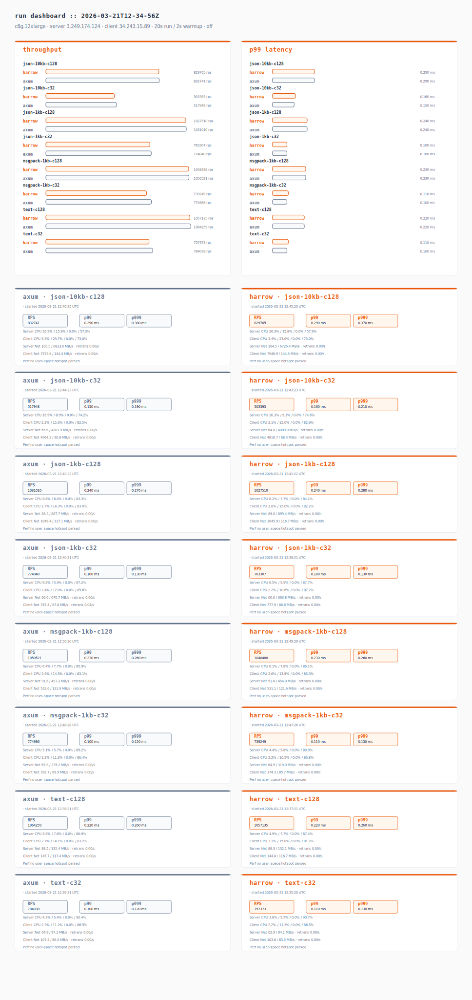
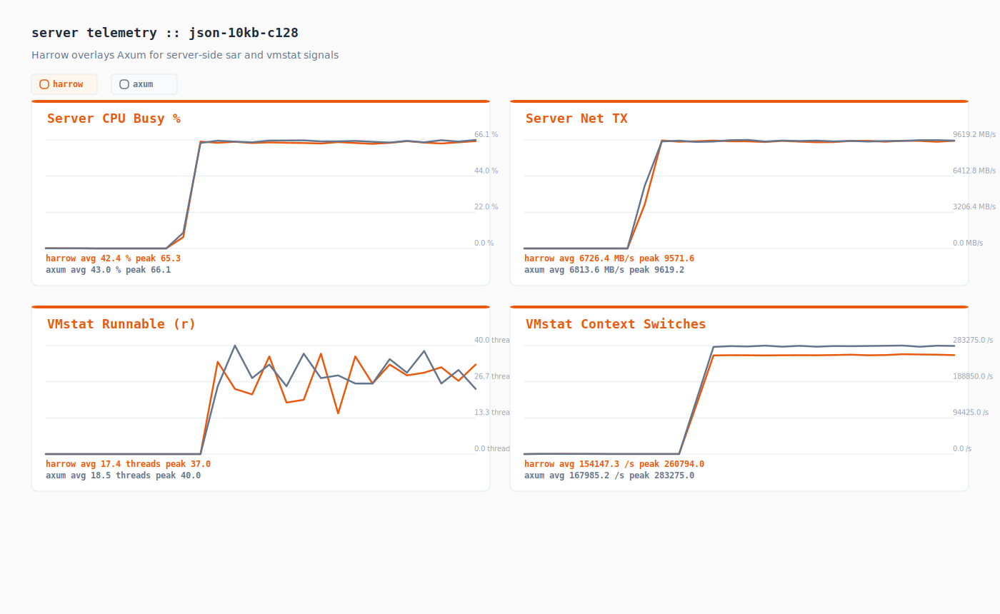
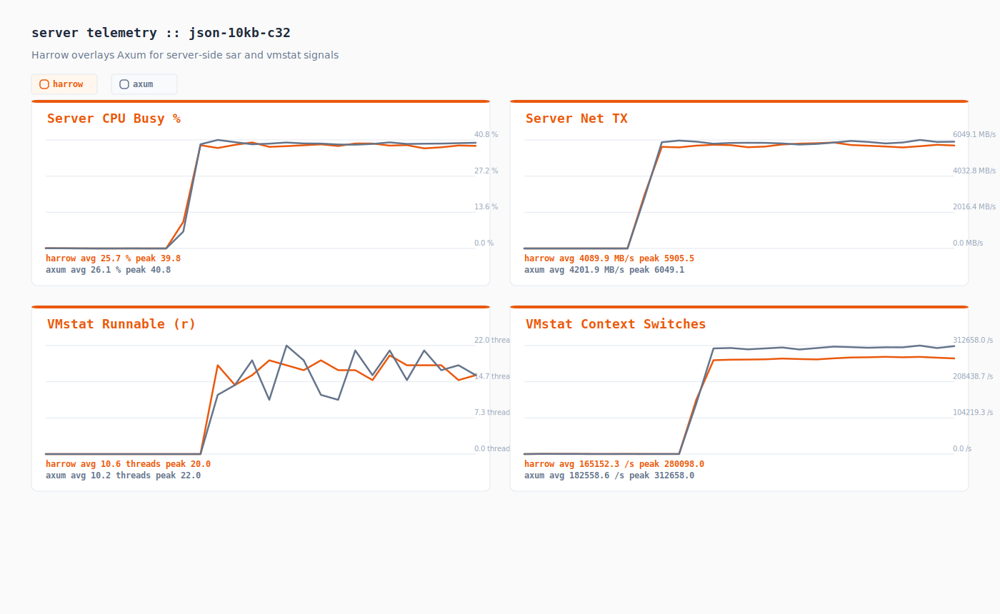
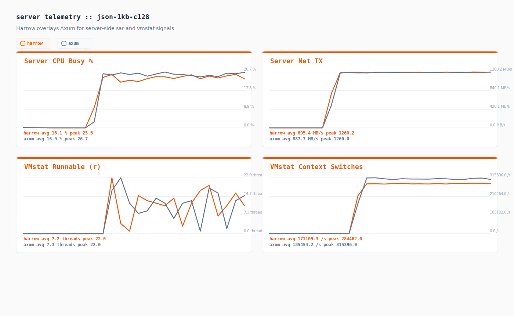
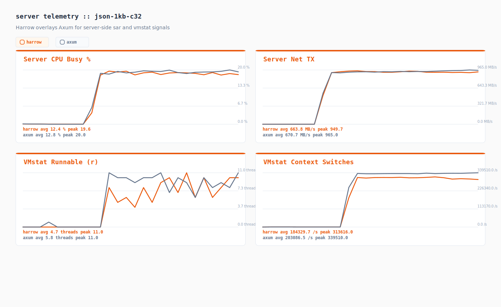
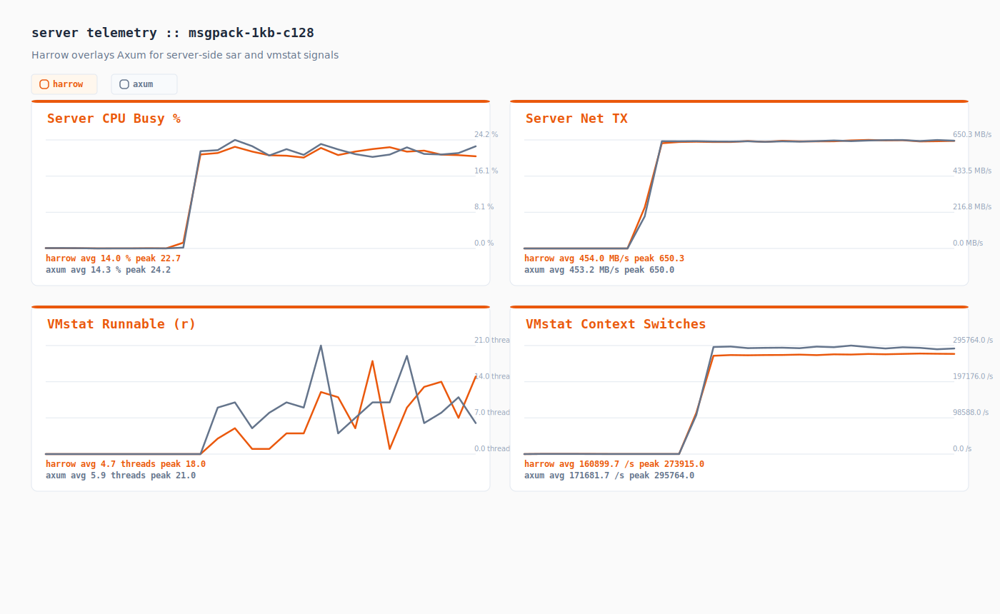
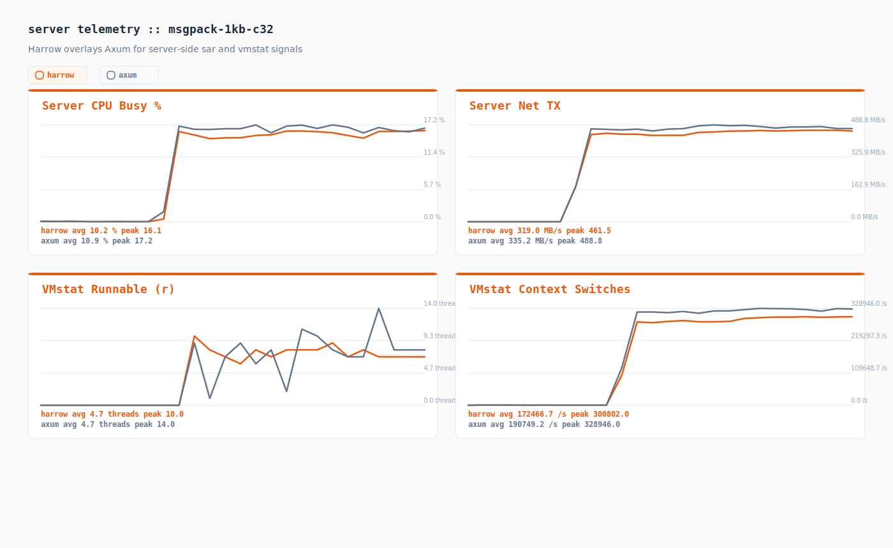
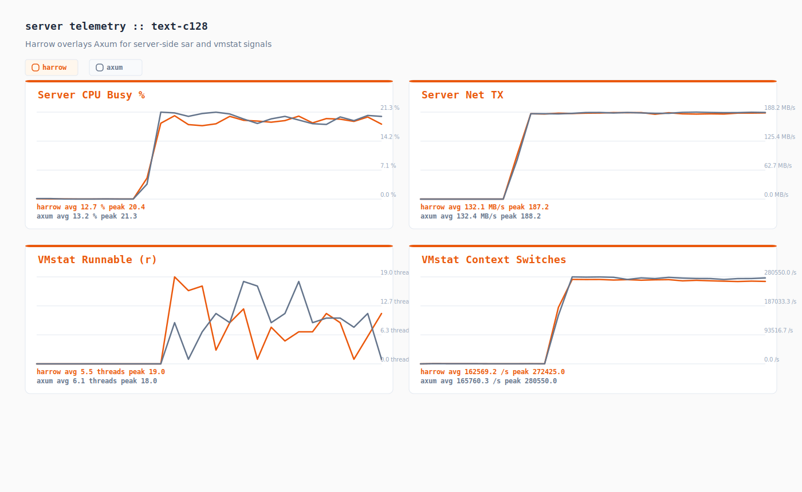
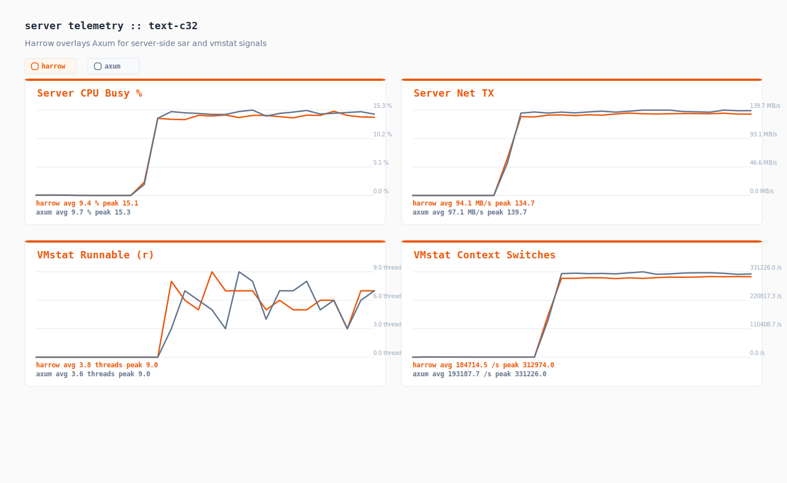

# Performance Test Results

Instance: c8g.12xlarge
Server: 3.249.174.124
Client: 34.243.15.89
Duration: 20s | Warmup: 2s
Spinr mode: docker
OS monitors: true
Perf: off
Date: 2026-03-21 12:50:53 UTC

## Runs

| Test case | Framework | Path | Concurrency | RPS | p50 (ms) | p99 (ms) | p999 (ms) |
|-----------|-----------|------|-------------|-----|----------|----------|-----------|
| json-10kb-c128 | axum |  | 0 | 832740.550 | 0.140 | 0.290 | 0.380 |
| json-10kb-c128 | harrow |  | 0 | 829704.600 | 0.140 | 0.290 | 0.370 |
| json-10kb-c32 | axum |  | 0 | 517947.950 | 0.090 | 0.150 | 0.190 |
| json-10kb-c32 | harrow |  | 0 | 503392.900 | 0.090 | 0.160 | 0.210 |
| json-1kb-c128 | axum |  | 0 | 1031009.950 | 0.120 | 0.240 | 0.270 |
| json-1kb-c128 | harrow |  | 0 | 1027509.850 | 0.120 | 0.240 | 0.280 |
| json-1kb-c32 | axum |  | 0 | 774040.050 | 0.060 | 0.100 | 0.130 |
| json-1kb-c32 | harrow |  | 0 | 763307.050 | 0.060 | 0.100 | 0.130 |
| msgpack-1kb-c128 | axum |  | 0 | 1050520.600 | 0.120 | 0.230 | 0.260 |
| msgpack-1kb-c128 | harrow |  | 0 | 1048487.800 | 0.120 | 0.230 | 0.260 |
| msgpack-1kb-c32 | axum |  | 0 | 774985.800 | 0.060 | 0.100 | 0.120 |
| msgpack-1kb-c32 | harrow |  | 0 | 739248.950 | 0.060 | 0.110 | 0.130 |
| text-c128 | axum |  | 0 | 1064258.900 | 0.120 | 0.220 | 0.260 |
| text-c128 | harrow |  | 0 | 1057134.750 | 0.120 | 0.220 | 0.260 |
| text-c32 | axum |  | 0 | 784038.350 | 0.060 | 0.100 | 0.120 |
| text-c32 | harrow |  | 0 | 757373.000 | 0.060 | 0.110 | 0.130 |

## Comparison

| Test case | Harrow RPS | Axum RPS | Delta % | Harrow p99 (ms) | Axum p99 (ms) |
|-----------|------------|----------|---------|------------------|---------------|
| json-10kb-c128 | 829704.600 | 832740.550 | -0.36% | 0.290 | 0.290 |
| json-10kb-c32 | 503392.900 | 517947.950 | -2.81% | 0.160 | 0.150 |
| json-1kb-c128 | 1027509.850 | 1031009.950 | -0.34% | 0.240 | 0.240 |
| json-1kb-c32 | 763307.050 | 774040.050 | -1.39% | 0.100 | 0.100 |
| msgpack-1kb-c128 | 1048487.800 | 1050520.600 | -0.19% | 0.230 | 0.230 |
| msgpack-1kb-c32 | 739248.950 | 774985.800 | -4.61% | 0.110 | 0.100 |
| text-c128 | 1057134.750 | 1064258.900 | -0.67% | 0.220 | 0.220 |
| text-c32 | 757373.000 | 784038.350 | -3.40% | 0.110 | 0.100 |

## Telemetry Digest

| Run | Server CPU (user/sys/wait/idle) | Client CPU (user/sys/wait/idle) | Server Net (rx/tx MB/s, retrans/s) | Client Net (rx/tx MB/s, retrans/s) | Top Perf Hotspot |
|-----|----------------------------------|----------------------------------|------------------------------------|------------------------------------|------------------|
| axum_json-10kb-c128 | 26.9% / 15.8% / 0.0% / 57.3% | 3.3% / 23.7% / 0.0% / 73.0% | 105.5 / 6813.6 MB/s · retrans 0.00/s | 7973.6 / 144.4 MB/s · retrans 0.00/s | - |
| harrow_json-10kb-c128 | 26.3% / 15.8% / 0.0% / 57.9% | 3.4% / 23.6% / 0.0% / 73.0% | 104.5 / 6726.4 MB/s · retrans 0.00/s | 7946.9 / 144.5 MB/s · retrans 0.00/s | - |
| axum_json-10kb-c32 | 16.9% / 8.9% / 0.0% / 74.2% | 2.2% / 15.3% / 0.0% / 82.5% | 65.6 / 4201.9 MB/s · retrans 0.00/s | 4964.2 / 90.8 MB/s · retrans 0.00/s | - |
| harrow_json-10kb-c32 | 16.3% / 9.1% / 0.0% / 74.6% | 2.1% / 15.0% / 0.0% / 82.9% | 64.0 / 4089.9 MB/s · retrans 0.00/s | 4816.7 / 88.3 MB/s · retrans 0.00/s | - |
| axum_json-1kb-c128 | 8.8% / 8.0% / 0.0% / 83.3% | 2.7% / 14.3% / 0.0% / 83.0% | 88.2 / 887.7 MB/s · retrans 0.00/s | 1049.4 / 117.1 MB/s · retrans 0.00/s | - |
| harrow_json-1kb-c128 | 8.2% / 7.7% / 0.0% / 84.1% | 2.8% / 15.0% / 0.0% / 82.2% | 89.0 / 895.4 MB/s · retrans 0.00/s | 1045.9 / 116.7 MB/s · retrans 0.00/s | - |
| axum_json-1kb-c32 | 6.8% / 5.9% / 0.0% / 87.2% | 2.4% / 12.0% / 0.0% / 85.6% | 66.6 / 670.7 MB/s · retrans 0.00/s | 787.4 / 87.8 MB/s · retrans 0.04/s | - |
| harrow_json-1kb-c32 | 6.5% / 5.9% / 0.0% / 87.7% | 2.2% / 10.6% / 0.0% / 87.2% | 66.0 / 663.8 MB/s · retrans 0.00/s | 777.9 / 86.8 MB/s · retrans 0.00/s | - |
| axum_msgpack-1kb-c128 | 6.4% / 7.7% / 0.0% / 85.9% | 2.6% / 14.3% / 0.0% / 83.1% | 91.6 / 453.2 MB/s · retrans 0.00/s | 532.6 / 121.9 MB/s · retrans 0.00/s | - |
| harrow_msgpack-1kb-c128 | 6.1% / 7.8% / 0.0% / 86.1% | 2.6% / 13.9% / 0.0% / 83.5% | 91.8 / 454.0 MB/s · retrans 0.00/s | 531.1 / 121.6 MB/s · retrans 0.00/s | - |
| axum_msgpack-1kb-c32 | 5.1% / 5.7% / 0.0% / 89.2% | 2.2% / 11.3% / 0.0% / 86.4% | 67.8 / 335.2 MB/s · retrans 0.00/s | 392.7 / 89.9 MB/s · retrans 0.00/s | - |
| harrow_msgpack-1kb-c32 | 4.4% / 5.8% / 0.0% / 89.9% | 2.2% / 10.9% / 0.0% / 86.8% | 64.5 / 319.0 MB/s · retrans 0.00/s | 374.3 / 85.7 MB/s · retrans 0.00/s | - |
| axum_text-c128 | 5.5% / 7.6% / 0.0% / 86.9% | 2.7% / 14.1% / 0.0% / 83.2% | 88.5 / 132.4 MB/s · retrans 0.00/s | 145.7 / 117.4 MB/s · retrans 0.00/s | - |
| harrow_text-c128 | 4.9% / 7.7% / 0.0% / 87.4% | 3.1% / 15.8% / 0.0% / 81.2% | 88.3 / 132.1 MB/s · retrans 0.00/s | 144.8 / 116.7 MB/s · retrans 0.00/s | - |
| axum_text-c32 | 4.2% / 5.4% / 0.0% / 90.4% | 2.3% / 11.2% / 0.0% / 86.5% | 64.9 / 97.1 MB/s · retrans 0.00/s | 107.4 / 86.5 MB/s · retrans 0.00/s | - |
| harrow_text-c32 | 3.8% / 5.5% / 0.0% / 90.7% | 2.2% / 11.3% / 0.0% / 86.5% | 62.9 / 94.1 MB/s · retrans 0.00/s | 103.6 / 83.5 MB/s · retrans 0.00/s | - |

## Telemetry Charts

### json-10kb-c128

### json-10kb-c32

### json-1kb-c128

### json-1kb-c32

### msgpack-1kb-c128

### msgpack-1kb-c32

### text-c128

### text-c32

## Artifacts

| Run | JSON | Perf Report | Perf Script | Perf SVG | Server CPU | Server Net | Client CPU | Client Net |
|-----|------|-------------|-------------|----------|------------|------------|------------|------------|
| axum_json-10kb-c128 | [json](./axum_json-10kb-c128.json) | [perf-report](./axum_json-10kb-c128.server.perf-report.txt) | [perf-script](./axum_json-10kb-c128.server.perf.script) | - | [server cpu](./axum_json-10kb-c128.server.sar-u.txt) | [server net](./axum_json-10kb-c128.server.sar-net.txt) | [client cpu](./axum_json-10kb-c128.client.sar-u.txt) | [client net](./axum_json-10kb-c128.client.sar-net.txt) |
| harrow_json-10kb-c128 | [json](./harrow_json-10kb-c128.json) | [perf-report](./harrow_json-10kb-c128.server.perf-report.txt) | [perf-script](./harrow_json-10kb-c128.server.perf.script) | - | [server cpu](./harrow_json-10kb-c128.server.sar-u.txt) | [server net](./harrow_json-10kb-c128.server.sar-net.txt) | [client cpu](./harrow_json-10kb-c128.client.sar-u.txt) | [client net](./harrow_json-10kb-c128.client.sar-net.txt) |
| axum_json-10kb-c32 | [json](./axum_json-10kb-c32.json) | [perf-report](./axum_json-10kb-c32.server.perf-report.txt) | [perf-script](./axum_json-10kb-c32.server.perf.script) | - | [server cpu](./axum_json-10kb-c32.server.sar-u.txt) | [server net](./axum_json-10kb-c32.server.sar-net.txt) | [client cpu](./axum_json-10kb-c32.client.sar-u.txt) | [client net](./axum_json-10kb-c32.client.sar-net.txt) |
| harrow_json-10kb-c32 | [json](./harrow_json-10kb-c32.json) | [perf-report](./harrow_json-10kb-c32.server.perf-report.txt) | [perf-script](./harrow_json-10kb-c32.server.perf.script) | - | [server cpu](./harrow_json-10kb-c32.server.sar-u.txt) | [server net](./harrow_json-10kb-c32.server.sar-net.txt) | [client cpu](./harrow_json-10kb-c32.client.sar-u.txt) | [client net](./harrow_json-10kb-c32.client.sar-net.txt) |
| axum_json-1kb-c128 | [json](./axum_json-1kb-c128.json) | [perf-report](./axum_json-1kb-c128.server.perf-report.txt) | [perf-script](./axum_json-1kb-c128.server.perf.script) | - | [server cpu](./axum_json-1kb-c128.server.sar-u.txt) | [server net](./axum_json-1kb-c128.server.sar-net.txt) | [client cpu](./axum_json-1kb-c128.client.sar-u.txt) | [client net](./axum_json-1kb-c128.client.sar-net.txt) |
| harrow_json-1kb-c128 | [json](./harrow_json-1kb-c128.json) | [perf-report](./harrow_json-1kb-c128.server.perf-report.txt) | [perf-script](./harrow_json-1kb-c128.server.perf.script) | - | [server cpu](./harrow_json-1kb-c128.server.sar-u.txt) | [server net](./harrow_json-1kb-c128.server.sar-net.txt) | [client cpu](./harrow_json-1kb-c128.client.sar-u.txt) | [client net](./harrow_json-1kb-c128.client.sar-net.txt) |
| axum_json-1kb-c32 | [json](./axum_json-1kb-c32.json) | [perf-report](./axum_json-1kb-c32.server.perf-report.txt) | [perf-script](./axum_json-1kb-c32.server.perf.script) | - | [server cpu](./axum_json-1kb-c32.server.sar-u.txt) | [server net](./axum_json-1kb-c32.server.sar-net.txt) | [client cpu](./axum_json-1kb-c32.client.sar-u.txt) | [client net](./axum_json-1kb-c32.client.sar-net.txt) |
| harrow_json-1kb-c32 | [json](./harrow_json-1kb-c32.json) | [perf-report](./harrow_json-1kb-c32.server.perf-report.txt) | [perf-script](./harrow_json-1kb-c32.server.perf.script) | - | [server cpu](./harrow_json-1kb-c32.server.sar-u.txt) | [server net](./harrow_json-1kb-c32.server.sar-net.txt) | [client cpu](./harrow_json-1kb-c32.client.sar-u.txt) | [client net](./harrow_json-1kb-c32.client.sar-net.txt) |
| axum_msgpack-1kb-c128 | [json](./axum_msgpack-1kb-c128.json) | [perf-report](./axum_msgpack-1kb-c128.server.perf-report.txt) | [perf-script](./axum_msgpack-1kb-c128.server.perf.script) | - | [server cpu](./axum_msgpack-1kb-c128.server.sar-u.txt) | [server net](./axum_msgpack-1kb-c128.server.sar-net.txt) | [client cpu](./axum_msgpack-1kb-c128.client.sar-u.txt) | [client net](./axum_msgpack-1kb-c128.client.sar-net.txt) |
| harrow_msgpack-1kb-c128 | [json](./harrow_msgpack-1kb-c128.json) | [perf-report](./harrow_msgpack-1kb-c128.server.perf-report.txt) | [perf-script](./harrow_msgpack-1kb-c128.server.perf.script) | - | [server cpu](./harrow_msgpack-1kb-c128.server.sar-u.txt) | [server net](./harrow_msgpack-1kb-c128.server.sar-net.txt) | [client cpu](./harrow_msgpack-1kb-c128.client.sar-u.txt) | [client net](./harrow_msgpack-1kb-c128.client.sar-net.txt) |
| axum_msgpack-1kb-c32 | [json](./axum_msgpack-1kb-c32.json) | [perf-report](./axum_msgpack-1kb-c32.server.perf-report.txt) | [perf-script](./axum_msgpack-1kb-c32.server.perf.script) | - | [server cpu](./axum_msgpack-1kb-c32.server.sar-u.txt) | [server net](./axum_msgpack-1kb-c32.server.sar-net.txt) | [client cpu](./axum_msgpack-1kb-c32.client.sar-u.txt) | [client net](./axum_msgpack-1kb-c32.client.sar-net.txt) |
| harrow_msgpack-1kb-c32 | [json](./harrow_msgpack-1kb-c32.json) | [perf-report](./harrow_msgpack-1kb-c32.server.perf-report.txt) | [perf-script](./harrow_msgpack-1kb-c32.server.perf.script) | - | [server cpu](./harrow_msgpack-1kb-c32.server.sar-u.txt) | [server net](./harrow_msgpack-1kb-c32.server.sar-net.txt) | [client cpu](./harrow_msgpack-1kb-c32.client.sar-u.txt) | [client net](./harrow_msgpack-1kb-c32.client.sar-net.txt) |
| axum_text-c128 | [json](./axum_text-c128.json) | [perf-report](./axum_text-c128.server.perf-report.txt) | [perf-script](./axum_text-c128.server.perf.script) | - | [server cpu](./axum_text-c128.server.sar-u.txt) | [server net](./axum_text-c128.server.sar-net.txt) | [client cpu](./axum_text-c128.client.sar-u.txt) | [client net](./axum_text-c128.client.sar-net.txt) |
| harrow_text-c128 | [json](./harrow_text-c128.json) | [perf-report](./harrow_text-c128.server.perf-report.txt) | [perf-script](./harrow_text-c128.server.perf.script) | - | [server cpu](./harrow_text-c128.server.sar-u.txt) | [server net](./harrow_text-c128.server.sar-net.txt) | [client cpu](./harrow_text-c128.client.sar-u.txt) | [client net](./harrow_text-c128.client.sar-net.txt) |
| axum_text-c32 | [json](./axum_text-c32.json) | [perf-report](./axum_text-c32.server.perf-report.txt) | [perf-script](./axum_text-c32.server.perf.script) | - | [server cpu](./axum_text-c32.server.sar-u.txt) | [server net](./axum_text-c32.server.sar-net.txt) | [client cpu](./axum_text-c32.client.sar-u.txt) | [client net](./axum_text-c32.client.sar-net.txt) |
| harrow_text-c32 | [json](./harrow_text-c32.json) | [perf-report](./harrow_text-c32.server.perf-report.txt) | [perf-script](./harrow_text-c32.server.perf.script) | - | [server cpu](./harrow_text-c32.server.sar-u.txt) | [server net](./harrow_text-c32.server.sar-net.txt) | [client cpu](./harrow_text-c32.client.sar-u.txt) | [client net](./harrow_text-c32.client.sar-net.txt) |
