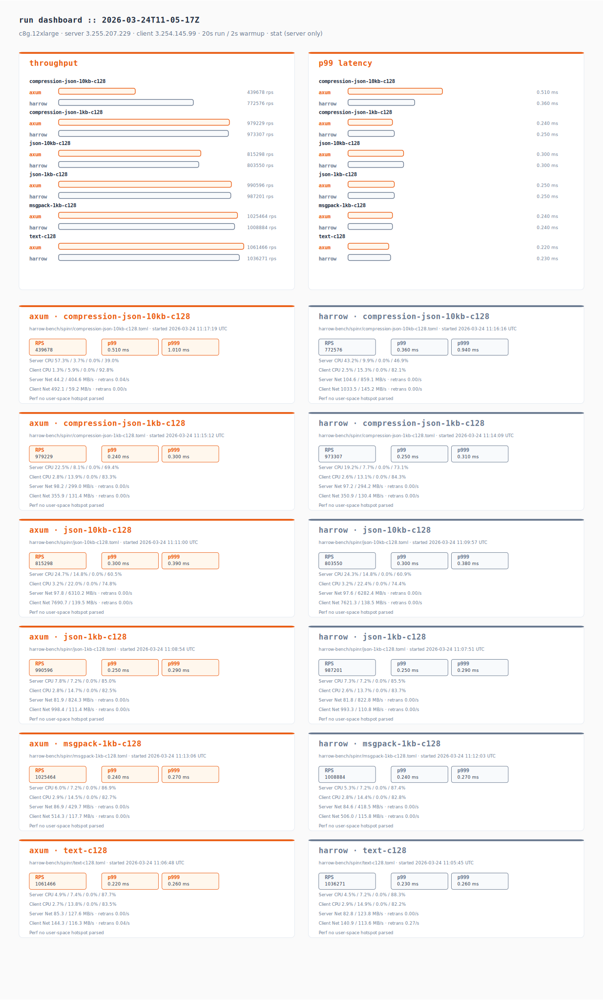
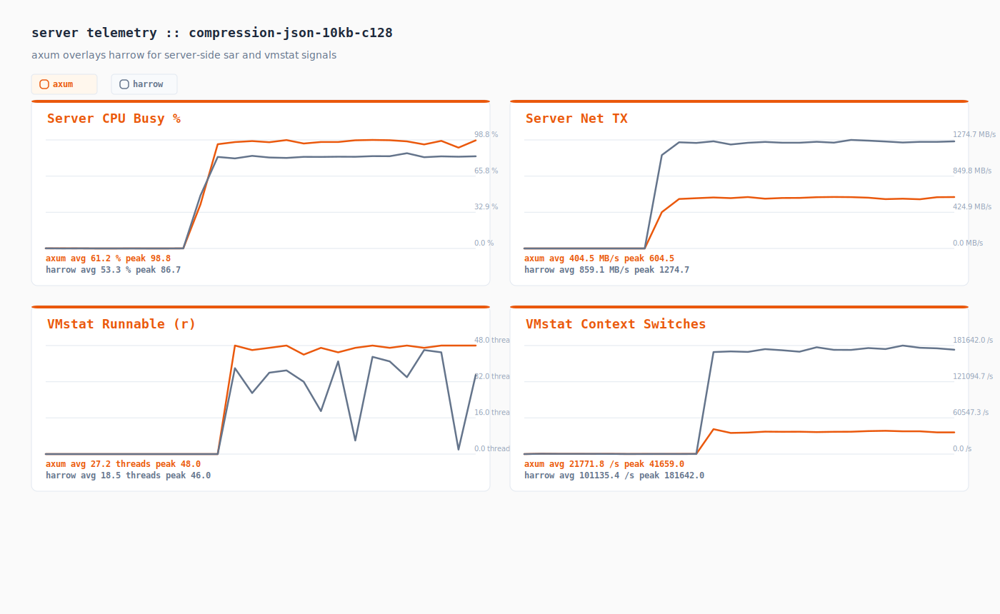
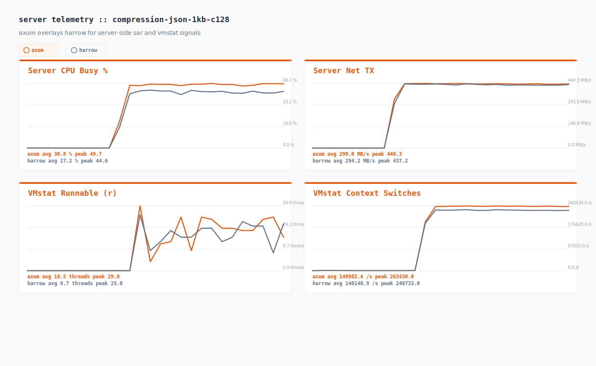
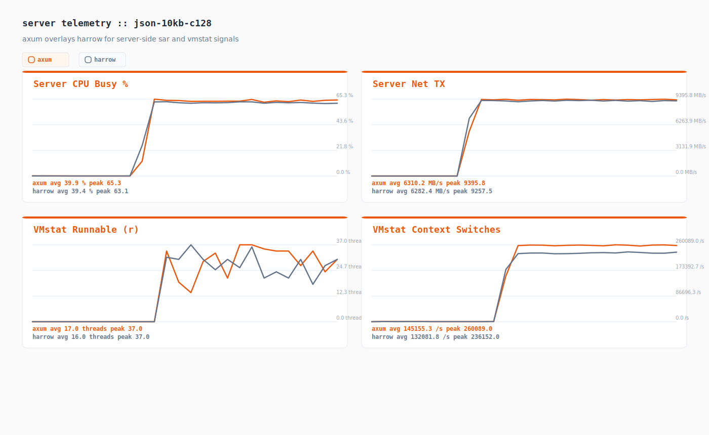
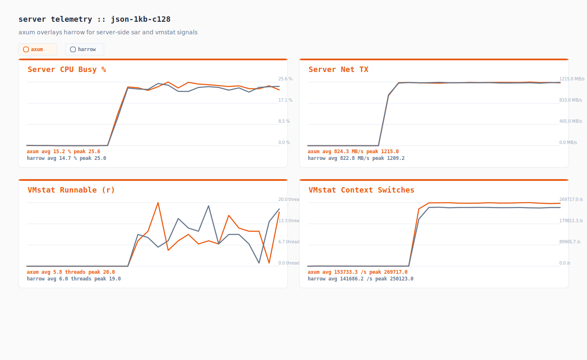
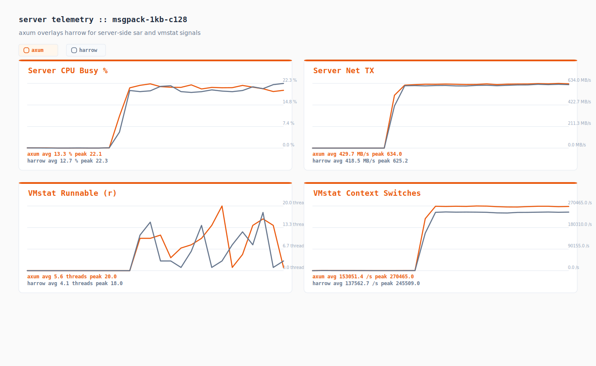
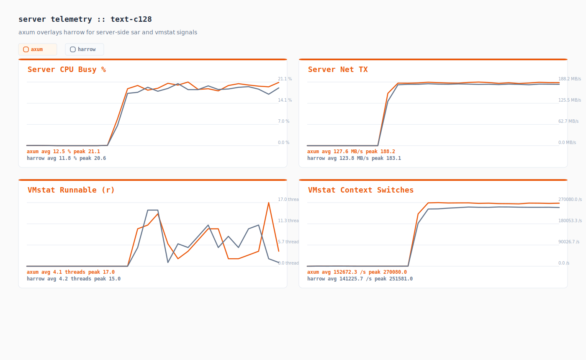

# Performance Test Results

Instance: c8g.12xlarge
Server: 3.255.207.229
Client: 3.254.145.99
Duration: 20s | Warmup: 2s
Spinr mode: docker
OS monitors: true
Perf: stat (server only)
Date: 2026-03-24 11:17:42 UTC

## Runs

| Test case | Framework | Path | Concurrency | RPS | p50 (ms) | p99 (ms) | p999 (ms) |
|-----------|-----------|------|-------------|-----|----------|----------|-----------|
| compression-json-10kb-c128 | axum | harrow-bench/spinr/compression-json-10kb-c128.toml | 128 | 439678.250 | 0.290 | 0.510 | 1.010 |
| compression-json-10kb-c128 | harrow | harrow-bench/spinr/compression-json-10kb-c128.toml | 128 | 772575.900 | 0.160 | 0.360 | 0.940 |
| compression-json-1kb-c128 | axum | harrow-bench/spinr/compression-json-1kb-c128.toml | 128 | 979229.050 | 0.120 | 0.240 | 0.300 |
| compression-json-1kb-c128 | harrow | harrow-bench/spinr/compression-json-1kb-c128.toml | 128 | 973307.000 | 0.120 | 0.250 | 0.310 |
| json-10kb-c128 | axum | harrow-bench/spinr/json-10kb-c128.toml | 128 | 815298.350 | 0.150 | 0.300 | 0.390 |
| json-10kb-c128 | harrow | harrow-bench/spinr/json-10kb-c128.toml | 128 | 803550.100 | 0.150 | 0.300 | 0.380 |
| json-1kb-c128 | axum | harrow-bench/spinr/json-1kb-c128.toml | 128 | 990595.900 | 0.120 | 0.250 | 0.290 |
| json-1kb-c128 | harrow | harrow-bench/spinr/json-1kb-c128.toml | 128 | 987200.850 | 0.120 | 0.250 | 0.290 |
| msgpack-1kb-c128 | axum | harrow-bench/spinr/msgpack-1kb-c128.toml | 128 | 1025464.250 | 0.120 | 0.240 | 0.270 |
| msgpack-1kb-c128 | harrow | harrow-bench/spinr/msgpack-1kb-c128.toml | 128 | 1008884.000 | 0.120 | 0.240 | 0.270 |
| text-c128 | axum | harrow-bench/spinr/text-c128.toml | 128 | 1061465.500 | 0.120 | 0.220 | 0.260 |
| text-c128 | harrow | harrow-bench/spinr/text-c128.toml | 128 | 1036270.850 | 0.120 | 0.230 | 0.260 |

## Comparison

| Test case | axum RPS | harrow RPS | Delta % | axum p99 (ms) | harrow p99 (ms) |
|-----------|------------|----------|---------|------------------|---------------|
| compression-json-10kb-c128 | 439678.250 | 772575.900 | -43.09% | 0.510 | 0.360 |
| compression-json-1kb-c128 | 979229.050 | 973307.000 | +0.61% | 0.240 | 0.250 |
| json-10kb-c128 | 815298.350 | 803550.100 | +1.46% | 0.300 | 0.300 |
| json-1kb-c128 | 990595.900 | 987200.850 | +0.34% | 0.250 | 0.250 |
| msgpack-1kb-c128 | 1025464.250 | 1008884.000 | +1.64% | 0.240 | 0.240 |
| text-c128 | 1061465.500 | 1036270.850 | +2.43% | 0.220 | 0.230 |

## Telemetry Digest

| Run | Server CPU (user/sys/wait/idle) | Client CPU (user/sys/wait/idle) | Server Net (rx/tx MB/s, retrans/s) | Client Net (rx/tx MB/s, retrans/s) | Top Perf Hotspot |
|-----|----------------------------------|----------------------------------|------------------------------------|------------------------------------|------------------|
| axum_compression-json-10kb-c128 | 57.3% / 3.7% / 0.0% / 39.0% | 1.3% / 5.9% / 0.0% / 92.8% | 44.2 / 404.6 MB/s · retrans 0.04/s | 492.1 / 59.2 MB/s · retrans 0.00/s | - |
| harrow_compression-json-10kb-c128 | 43.2% / 9.9% / 0.0% / 46.9% | 2.5% / 15.3% / 0.0% / 82.1% | 104.6 / 859.1 MB/s · retrans 0.00/s | 1033.5 / 145.2 MB/s · retrans 0.00/s | - |
| axum_compression-json-1kb-c128 | 22.5% / 8.1% / 0.0% / 69.4% | 2.8% / 13.9% / 0.0% / 83.3% | 98.2 / 299.0 MB/s · retrans 0.00/s | 355.9 / 131.4 MB/s · retrans 0.00/s | - |
| harrow_compression-json-1kb-c128 | 19.2% / 7.7% / 0.0% / 73.1% | 2.6% / 13.1% / 0.0% / 84.3% | 97.2 / 294.2 MB/s · retrans 0.00/s | 350.9 / 130.4 MB/s · retrans 0.00/s | - |
| axum_json-10kb-c128 | 24.7% / 14.8% / 0.0% / 60.5% | 3.2% / 22.0% / 0.0% / 74.8% | 97.8 / 6310.2 MB/s · retrans 0.00/s | 7690.7 / 139.5 MB/s · retrans 0.00/s | - |
| harrow_json-10kb-c128 | 24.3% / 14.8% / 0.0% / 60.9% | 3.2% / 22.4% / 0.0% / 74.4% | 97.6 / 6282.4 MB/s · retrans 0.00/s | 7621.3 / 138.5 MB/s · retrans 0.00/s | - |
| axum_json-1kb-c128 | 7.8% / 7.2% / 0.0% / 85.0% | 2.8% / 14.7% / 0.0% / 82.5% | 81.9 / 824.3 MB/s · retrans 0.00/s | 998.4 / 111.4 MB/s · retrans 0.00/s | - |
| harrow_json-1kb-c128 | 7.3% / 7.2% / 0.0% / 85.5% | 2.6% / 13.7% / 0.0% / 83.7% | 81.8 / 822.8 MB/s · retrans 0.00/s | 993.3 / 110.8 MB/s · retrans 0.00/s | - |
| axum_msgpack-1kb-c128 | 6.0% / 7.2% / 0.0% / 86.9% | 2.9% / 14.5% / 0.0% / 82.7% | 86.9 / 429.7 MB/s · retrans 0.00/s | 514.3 / 117.7 MB/s · retrans 0.00/s | - |
| harrow_msgpack-1kb-c128 | 5.3% / 7.2% / 0.0% / 87.4% | 2.8% / 14.4% / 0.0% / 82.8% | 84.6 / 418.5 MB/s · retrans 0.00/s | 506.0 / 115.8 MB/s · retrans 0.00/s | - |
| axum_text-c128 | 4.9% / 7.4% / 0.0% / 87.7% | 2.7% / 13.8% / 0.0% / 83.5% | 85.3 / 127.6 MB/s · retrans 0.00/s | 144.3 / 116.3 MB/s · retrans 0.04/s | - |
| harrow_text-c128 | 4.5% / 7.2% / 0.0% / 88.3% | 2.9% / 14.9% / 0.0% / 82.2% | 82.8 / 123.8 MB/s · retrans 0.00/s | 140.9 / 113.6 MB/s · retrans 0.27/s | - |

## Telemetry Charts

### compression-json-10kb-c128

### compression-json-1kb-c128

### json-10kb-c128

### json-1kb-c128

### msgpack-1kb-c128

### text-c128

## Artifacts

| Run | JSON | Perf Report | Perf Script | Perf SVG | Server CPU | Server Net | Client CPU | Client Net |
|-----|------|-------------|-------------|----------|------------|------------|------------|------------|
| axum_compression-json-10kb-c128 | [json](./axum_compression-json-10kb-c128.json) | [perf-report](./axum_compression-json-10kb-c128.server.perf-report.txt) | [perf-script](./axum_compression-json-10kb-c128.server.perf.script) | - | [server cpu](./axum_compression-json-10kb-c128.server.sar-u.txt) | [server net](./axum_compression-json-10kb-c128.server.sar-net.txt) | [client cpu](./axum_compression-json-10kb-c128.client.sar-u.txt) | [client net](./axum_compression-json-10kb-c128.client.sar-net.txt) |
| harrow_compression-json-10kb-c128 | [json](./harrow_compression-json-10kb-c128.json) | [perf-report](./harrow_compression-json-10kb-c128.server.perf-report.txt) | [perf-script](./harrow_compression-json-10kb-c128.server.perf.script) | - | [server cpu](./harrow_compression-json-10kb-c128.server.sar-u.txt) | [server net](./harrow_compression-json-10kb-c128.server.sar-net.txt) | [client cpu](./harrow_compression-json-10kb-c128.client.sar-u.txt) | [client net](./harrow_compression-json-10kb-c128.client.sar-net.txt) |
| axum_compression-json-1kb-c128 | [json](./axum_compression-json-1kb-c128.json) | [perf-report](./axum_compression-json-1kb-c128.server.perf-report.txt) | [perf-script](./axum_compression-json-1kb-c128.server.perf.script) | - | [server cpu](./axum_compression-json-1kb-c128.server.sar-u.txt) | [server net](./axum_compression-json-1kb-c128.server.sar-net.txt) | [client cpu](./axum_compression-json-1kb-c128.client.sar-u.txt) | [client net](./axum_compression-json-1kb-c128.client.sar-net.txt) |
| harrow_compression-json-1kb-c128 | [json](./harrow_compression-json-1kb-c128.json) | [perf-report](./harrow_compression-json-1kb-c128.server.perf-report.txt) | [perf-script](./harrow_compression-json-1kb-c128.server.perf.script) | - | [server cpu](./harrow_compression-json-1kb-c128.server.sar-u.txt) | [server net](./harrow_compression-json-1kb-c128.server.sar-net.txt) | [client cpu](./harrow_compression-json-1kb-c128.client.sar-u.txt) | [client net](./harrow_compression-json-1kb-c128.client.sar-net.txt) |
| axum_json-10kb-c128 | [json](./axum_json-10kb-c128.json) | [perf-report](./axum_json-10kb-c128.server.perf-report.txt) | [perf-script](./axum_json-10kb-c128.server.perf.script) | - | [server cpu](./axum_json-10kb-c128.server.sar-u.txt) | [server net](./axum_json-10kb-c128.server.sar-net.txt) | [client cpu](./axum_json-10kb-c128.client.sar-u.txt) | [client net](./axum_json-10kb-c128.client.sar-net.txt) |
| harrow_json-10kb-c128 | [json](./harrow_json-10kb-c128.json) | [perf-report](./harrow_json-10kb-c128.server.perf-report.txt) | [perf-script](./harrow_json-10kb-c128.server.perf.script) | - | [server cpu](./harrow_json-10kb-c128.server.sar-u.txt) | [server net](./harrow_json-10kb-c128.server.sar-net.txt) | [client cpu](./harrow_json-10kb-c128.client.sar-u.txt) | [client net](./harrow_json-10kb-c128.client.sar-net.txt) |
| axum_json-1kb-c128 | [json](./axum_json-1kb-c128.json) | [perf-report](./axum_json-1kb-c128.server.perf-report.txt) | [perf-script](./axum_json-1kb-c128.server.perf.script) | - | [server cpu](./axum_json-1kb-c128.server.sar-u.txt) | [server net](./axum_json-1kb-c128.server.sar-net.txt) | [client cpu](./axum_json-1kb-c128.client.sar-u.txt) | [client net](./axum_json-1kb-c128.client.sar-net.txt) |
| harrow_json-1kb-c128 | [json](./harrow_json-1kb-c128.json) | [perf-report](./harrow_json-1kb-c128.server.perf-report.txt) | [perf-script](./harrow_json-1kb-c128.server.perf.script) | - | [server cpu](./harrow_json-1kb-c128.server.sar-u.txt) | [server net](./harrow_json-1kb-c128.server.sar-net.txt) | [client cpu](./harrow_json-1kb-c128.client.sar-u.txt) | [client net](./harrow_json-1kb-c128.client.sar-net.txt) |
| axum_msgpack-1kb-c128 | [json](./axum_msgpack-1kb-c128.json) | [perf-report](./axum_msgpack-1kb-c128.server.perf-report.txt) | [perf-script](./axum_msgpack-1kb-c128.server.perf.script) | - | [server cpu](./axum_msgpack-1kb-c128.server.sar-u.txt) | [server net](./axum_msgpack-1kb-c128.server.sar-net.txt) | [client cpu](./axum_msgpack-1kb-c128.client.sar-u.txt) | [client net](./axum_msgpack-1kb-c128.client.sar-net.txt) |
| harrow_msgpack-1kb-c128 | [json](./harrow_msgpack-1kb-c128.json) | [perf-report](./harrow_msgpack-1kb-c128.server.perf-report.txt) | [perf-script](./harrow_msgpack-1kb-c128.server.perf.script) | - | [server cpu](./harrow_msgpack-1kb-c128.server.sar-u.txt) | [server net](./harrow_msgpack-1kb-c128.server.sar-net.txt) | [client cpu](./harrow_msgpack-1kb-c128.client.sar-u.txt) | [client net](./harrow_msgpack-1kb-c128.client.sar-net.txt) |
| axum_text-c128 | [json](./axum_text-c128.json) | [perf-report](./axum_text-c128.server.perf-report.txt) | [perf-script](./axum_text-c128.server.perf.script) | - | [server cpu](./axum_text-c128.server.sar-u.txt) | [server net](./axum_text-c128.server.sar-net.txt) | [client cpu](./axum_text-c128.client.sar-u.txt) | [client net](./axum_text-c128.client.sar-net.txt) |
| harrow_text-c128 | [json](./harrow_text-c128.json) | [perf-report](./harrow_text-c128.server.perf-report.txt) | [perf-script](./harrow_text-c128.server.perf.script) | - | [server cpu](./harrow_text-c128.server.sar-u.txt) | [server net](./harrow_text-c128.server.sar-net.txt) | [client cpu](./harrow_text-c128.client.sar-u.txt) | [client net](./harrow_text-c128.client.sar-net.txt) |
