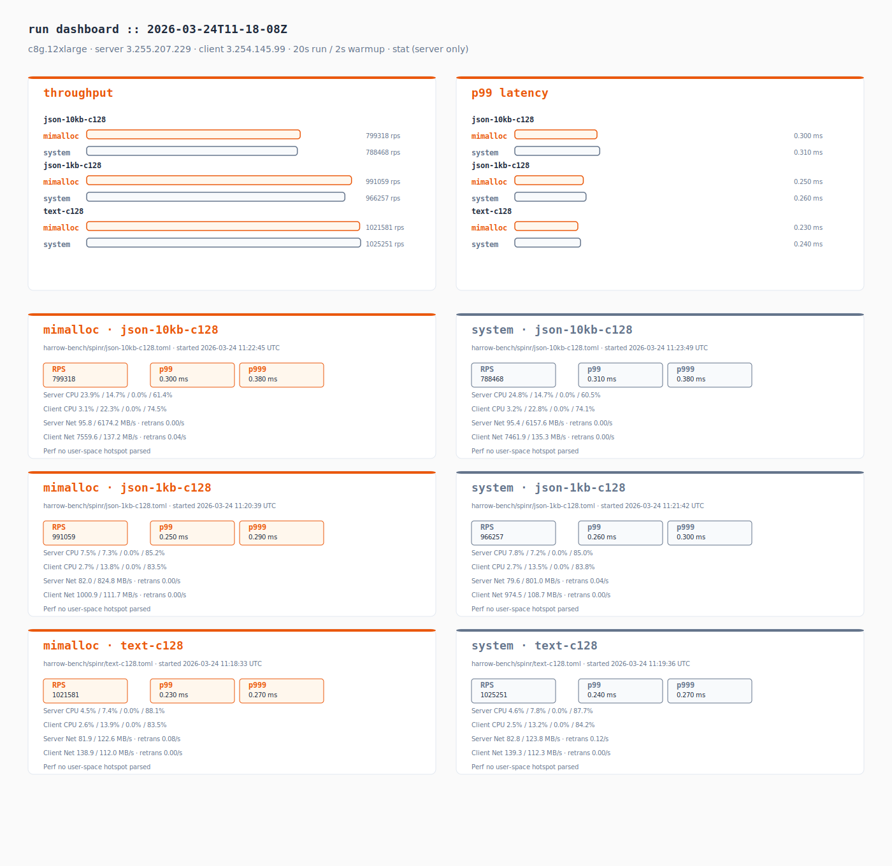
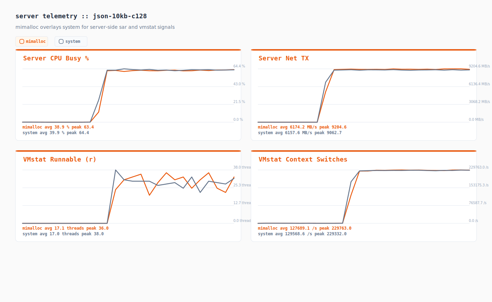
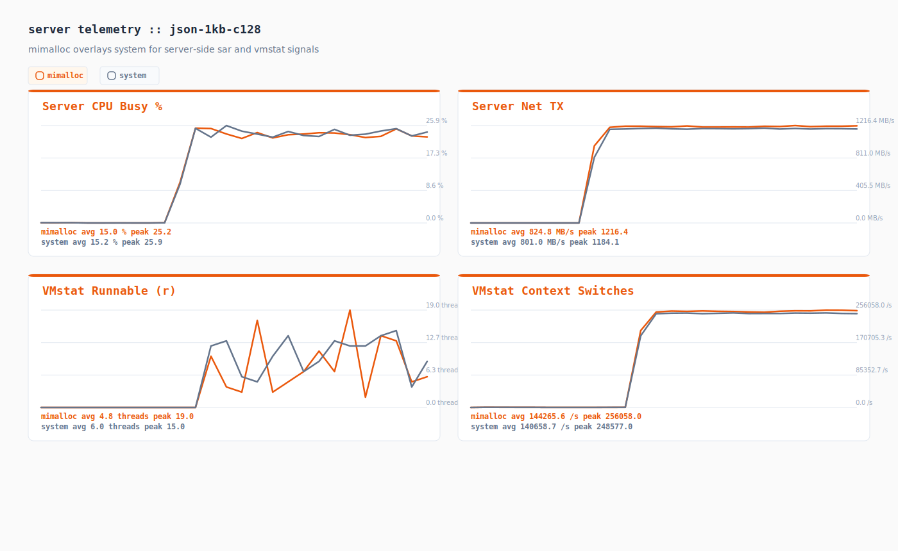
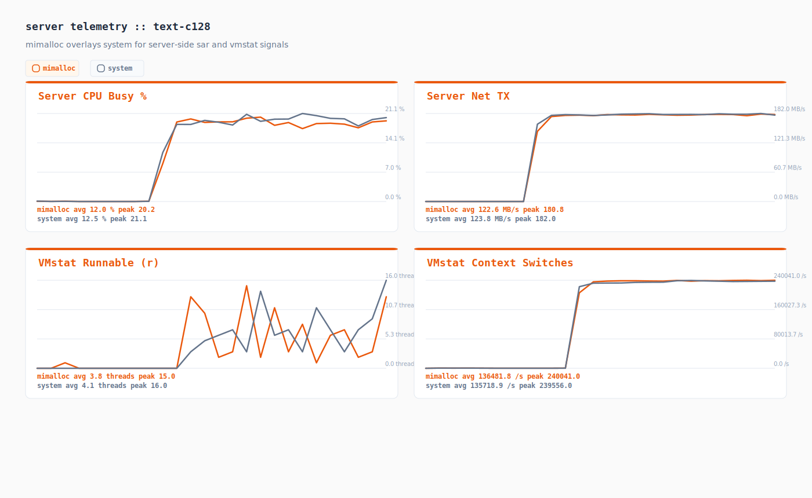

# Performance Test Results

Instance: c8g.12xlarge
Server: 3.255.207.229
Client: 3.254.145.99
Duration: 20s | Warmup: 2s
Spinr mode: docker
OS monitors: true
Perf: stat (server only)
Date: 2026-03-24 11:24:12 UTC

## Runs

| Test case | Framework | Path | Concurrency | RPS | p50 (ms) | p99 (ms) | p999 (ms) |
|-----------|-----------|------|-------------|-----|----------|----------|-----------|
| json-10kb-c128 | harrow | harrow-bench/spinr/json-10kb-c128.toml | 128 | 799317.650 | 0.150 | 0.300 | 0.380 |
| json-10kb-c128 | harrow | harrow-bench/spinr/json-10kb-c128.toml | 128 | 788468.100 | 0.150 | 0.310 | 0.380 |
| json-1kb-c128 | harrow | harrow-bench/spinr/json-1kb-c128.toml | 128 | 991058.850 | 0.120 | 0.250 | 0.290 |
| json-1kb-c128 | harrow | harrow-bench/spinr/json-1kb-c128.toml | 128 | 966256.650 | 0.130 | 0.260 | 0.300 |
| text-c128 | harrow | harrow-bench/spinr/text-c128.toml | 128 | 1021581.050 | 0.120 | 0.230 | 0.270 |
| text-c128 | harrow | harrow-bench/spinr/text-c128.toml | 128 | 1025250.750 | 0.120 | 0.240 | 0.270 |

## Comparison

| Test case | mimalloc RPS | system RPS | Delta % | mimalloc p99 (ms) | system p99 (ms) |
|-----------|------------|----------|---------|------------------|---------------|
| json-10kb-c128 | 799317.650 | 788468.100 | +1.38% | 0.300 | 0.310 |
| json-1kb-c128 | 991058.850 | 966256.650 | +2.57% | 0.250 | 0.260 |
| text-c128 | 1021581.050 | 1025250.750 | -0.36% | 0.230 | 0.240 |

## Telemetry Digest

| Run | Server CPU (user/sys/wait/idle) | Client CPU (user/sys/wait/idle) | Server Net (rx/tx MB/s, retrans/s) | Client Net (rx/tx MB/s, retrans/s) | Top Perf Hotspot |
|-----|----------------------------------|----------------------------------|------------------------------------|------------------------------------|------------------|
| mimalloc_json-10kb-c128 | 23.9% / 14.7% / 0.0% / 61.4% | 3.1% / 22.3% / 0.0% / 74.5% | 95.8 / 6174.2 MB/s · retrans 0.00/s | 7559.6 / 137.2 MB/s · retrans 0.04/s | - |
| system_json-10kb-c128 | 24.8% / 14.7% / 0.0% / 60.5% | 3.2% / 22.8% / 0.0% / 74.1% | 95.4 / 6157.6 MB/s · retrans 0.00/s | 7461.9 / 135.3 MB/s · retrans 0.00/s | - |
| mimalloc_json-1kb-c128 | 7.5% / 7.3% / 0.0% / 85.2% | 2.7% / 13.8% / 0.0% / 83.5% | 82.0 / 824.8 MB/s · retrans 0.00/s | 1000.9 / 111.7 MB/s · retrans 0.00/s | - |
| system_json-1kb-c128 | 7.8% / 7.2% / 0.0% / 85.0% | 2.7% / 13.5% / 0.0% / 83.8% | 79.6 / 801.0 MB/s · retrans 0.04/s | 974.5 / 108.7 MB/s · retrans 0.00/s | - |
| mimalloc_text-c128 | 4.5% / 7.4% / 0.0% / 88.1% | 2.6% / 13.9% / 0.0% / 83.5% | 81.9 / 122.6 MB/s · retrans 0.08/s | 138.9 / 112.0 MB/s · retrans 0.00/s | - |
| system_text-c128 | 4.6% / 7.8% / 0.0% / 87.7% | 2.5% / 13.2% / 0.0% / 84.2% | 82.8 / 123.8 MB/s · retrans 0.12/s | 139.3 / 112.3 MB/s · retrans 0.00/s | - |

## Telemetry Charts

### json-10kb-c128

### json-1kb-c128

### text-c128

## Artifacts

| Run | JSON | Perf Report | Perf Script | Perf SVG | Server CPU | Server Net | Client CPU | Client Net |
|-----|------|-------------|-------------|----------|------------|------------|------------|------------|
| mimalloc_json-10kb-c128 | [json](./mimalloc_json-10kb-c128.json) | [perf-report](./mimalloc_json-10kb-c128.server.perf-report.txt) | [perf-script](./mimalloc_json-10kb-c128.server.perf.script) | - | [server cpu](./mimalloc_json-10kb-c128.server.sar-u.txt) | [server net](./mimalloc_json-10kb-c128.server.sar-net.txt) | [client cpu](./mimalloc_json-10kb-c128.client.sar-u.txt) | [client net](./mimalloc_json-10kb-c128.client.sar-net.txt) |
| system_json-10kb-c128 | [json](./system_json-10kb-c128.json) | [perf-report](./system_json-10kb-c128.server.perf-report.txt) | [perf-script](./system_json-10kb-c128.server.perf.script) | - | [server cpu](./system_json-10kb-c128.server.sar-u.txt) | [server net](./system_json-10kb-c128.server.sar-net.txt) | [client cpu](./system_json-10kb-c128.client.sar-u.txt) | [client net](./system_json-10kb-c128.client.sar-net.txt) |
| mimalloc_json-1kb-c128 | [json](./mimalloc_json-1kb-c128.json) | [perf-report](./mimalloc_json-1kb-c128.server.perf-report.txt) | [perf-script](./mimalloc_json-1kb-c128.server.perf.script) | - | [server cpu](./mimalloc_json-1kb-c128.server.sar-u.txt) | [server net](./mimalloc_json-1kb-c128.server.sar-net.txt) | [client cpu](./mimalloc_json-1kb-c128.client.sar-u.txt) | [client net](./mimalloc_json-1kb-c128.client.sar-net.txt) |
| system_json-1kb-c128 | [json](./system_json-1kb-c128.json) | [perf-report](./system_json-1kb-c128.server.perf-report.txt) | [perf-script](./system_json-1kb-c128.server.perf.script) | - | [server cpu](./system_json-1kb-c128.server.sar-u.txt) | [server net](./system_json-1kb-c128.server.sar-net.txt) | [client cpu](./system_json-1kb-c128.client.sar-u.txt) | [client net](./system_json-1kb-c128.client.sar-net.txt) |
| mimalloc_text-c128 | [json](./mimalloc_text-c128.json) | [perf-report](./mimalloc_text-c128.server.perf-report.txt) | [perf-script](./mimalloc_text-c128.server.perf.script) | - | [server cpu](./mimalloc_text-c128.server.sar-u.txt) | [server net](./mimalloc_text-c128.server.sar-net.txt) | [client cpu](./mimalloc_text-c128.client.sar-u.txt) | [client net](./mimalloc_text-c128.client.sar-net.txt) |
| system_text-c128 | [json](./system_text-c128.json) | [perf-report](./system_text-c128.server.perf-report.txt) | [perf-script](./system_text-c128.server.perf.script) | - | [server cpu](./system_text-c128.server.sar-u.txt) | [server net](./system_text-c128.server.sar-net.txt) | [client cpu](./system_text-c128.client.sar-u.txt) | [client net](./system_text-c128.client.sar-net.txt) |
