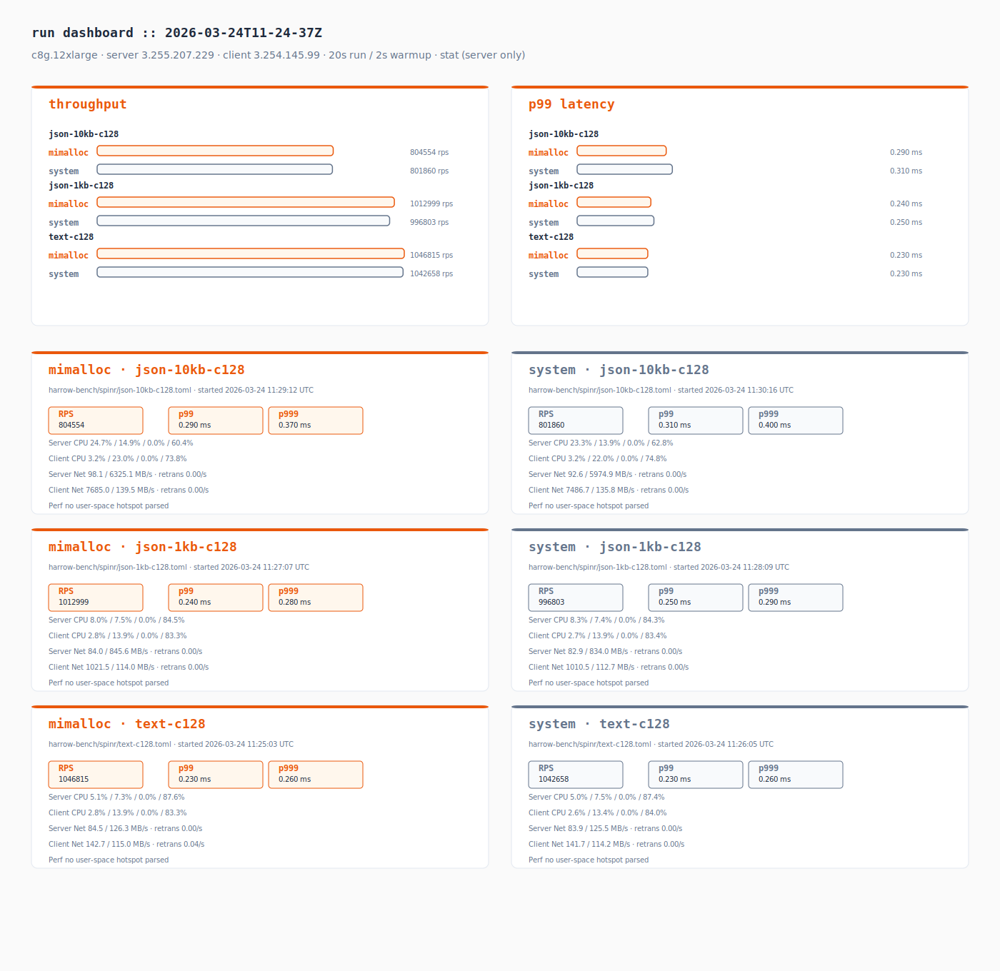
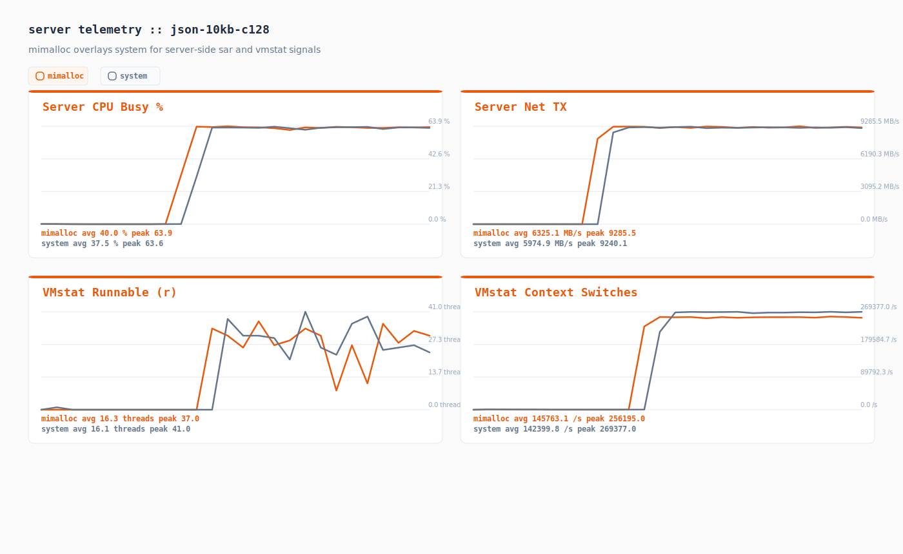
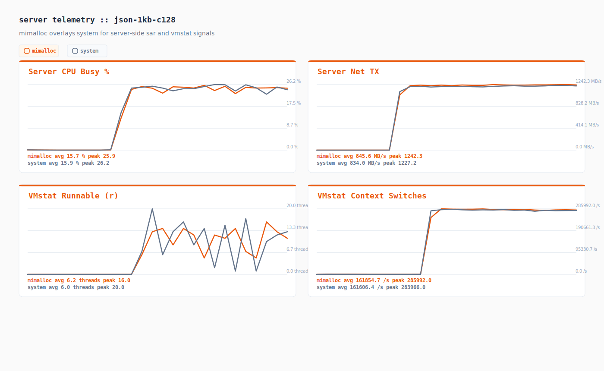
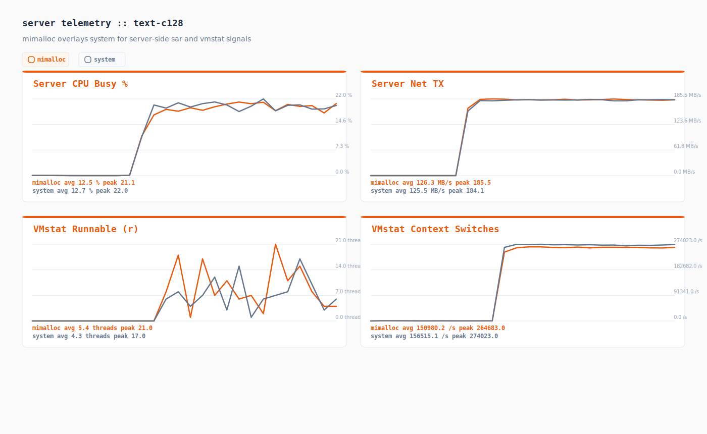

# Performance Test Results

Instance: c8g.12xlarge
Server: 3.255.207.229
Client: 3.254.145.99
Duration: 20s | Warmup: 2s
Spinr mode: docker
OS monitors: true
Perf: stat (server only)
Date: 2026-03-24 11:30:39 UTC

## Runs

| Test case | Framework | Path | Concurrency | RPS | p50 (ms) | p99 (ms) | p999 (ms) |
|-----------|-----------|------|-------------|-----|----------|----------|-----------|
| json-10kb-c128 | axum | harrow-bench/spinr/json-10kb-c128.toml | 128 | 804553.750 | 0.150 | 0.290 | 0.370 |
| json-10kb-c128 | axum | harrow-bench/spinr/json-10kb-c128.toml | 128 | 801860.500 | 0.150 | 0.310 | 0.400 |
| json-1kb-c128 | axum | harrow-bench/spinr/json-1kb-c128.toml | 128 | 1012998.700 | 0.120 | 0.240 | 0.280 |
| json-1kb-c128 | axum | harrow-bench/spinr/json-1kb-c128.toml | 128 | 996802.850 | 0.120 | 0.250 | 0.290 |
| text-c128 | axum | harrow-bench/spinr/text-c128.toml | 128 | 1046814.600 | 0.120 | 0.230 | 0.260 |
| text-c128 | axum | harrow-bench/spinr/text-c128.toml | 128 | 1042657.750 | 0.120 | 0.230 | 0.260 |

## Comparison

| Test case | mimalloc RPS | system RPS | Delta % | mimalloc p99 (ms) | system p99 (ms) |
|-----------|------------|----------|---------|------------------|---------------|
| json-10kb-c128 | 804553.750 | 801860.500 | +0.34% | 0.290 | 0.310 |
| json-1kb-c128 | 1012998.700 | 996802.850 | +1.62% | 0.240 | 0.250 |
| text-c128 | 1046814.600 | 1042657.750 | +0.40% | 0.230 | 0.230 |

## Telemetry Digest

| Run | Server CPU (user/sys/wait/idle) | Client CPU (user/sys/wait/idle) | Server Net (rx/tx MB/s, retrans/s) | Client Net (rx/tx MB/s, retrans/s) | Top Perf Hotspot |
|-----|----------------------------------|----------------------------------|------------------------------------|------------------------------------|------------------|
| mimalloc_json-10kb-c128 | 24.7% / 14.9% / 0.0% / 60.4% | 3.2% / 23.0% / 0.0% / 73.8% | 98.1 / 6325.1 MB/s · retrans 0.00/s | 7685.0 / 139.5 MB/s · retrans 0.00/s | - |
| system_json-10kb-c128 | 23.3% / 13.9% / 0.0% / 62.8% | 3.2% / 22.0% / 0.0% / 74.8% | 92.6 / 5974.9 MB/s · retrans 0.00/s | 7486.7 / 135.8 MB/s · retrans 0.00/s | - |
| mimalloc_json-1kb-c128 | 8.0% / 7.5% / 0.0% / 84.5% | 2.8% / 13.9% / 0.0% / 83.3% | 84.0 / 845.6 MB/s · retrans 0.00/s | 1021.5 / 114.0 MB/s · retrans 0.00/s | - |
| system_json-1kb-c128 | 8.3% / 7.4% / 0.0% / 84.3% | 2.7% / 13.9% / 0.0% / 83.4% | 82.9 / 834.0 MB/s · retrans 0.00/s | 1010.5 / 112.7 MB/s · retrans 0.00/s | - |
| mimalloc_text-c128 | 5.1% / 7.3% / 0.0% / 87.6% | 2.8% / 13.9% / 0.0% / 83.3% | 84.5 / 126.3 MB/s · retrans 0.00/s | 142.7 / 115.0 MB/s · retrans 0.04/s | - |
| system_text-c128 | 5.0% / 7.5% / 0.0% / 87.4% | 2.6% / 13.4% / 0.0% / 84.0% | 83.9 / 125.5 MB/s · retrans 0.00/s | 141.7 / 114.2 MB/s · retrans 0.00/s | - |

## Telemetry Charts

### json-10kb-c128

### json-1kb-c128

### text-c128

## Artifacts

| Run | JSON | Perf Report | Perf Script | Perf SVG | Server CPU | Server Net | Client CPU | Client Net |
|-----|------|-------------|-------------|----------|------------|------------|------------|------------|
| mimalloc_json-10kb-c128 | [json](./mimalloc_json-10kb-c128.json) | [perf-report](./mimalloc_json-10kb-c128.server.perf-report.txt) | [perf-script](./mimalloc_json-10kb-c128.server.perf.script) | - | [server cpu](./mimalloc_json-10kb-c128.server.sar-u.txt) | [server net](./mimalloc_json-10kb-c128.server.sar-net.txt) | [client cpu](./mimalloc_json-10kb-c128.client.sar-u.txt) | [client net](./mimalloc_json-10kb-c128.client.sar-net.txt) |
| system_json-10kb-c128 | [json](./system_json-10kb-c128.json) | [perf-report](./system_json-10kb-c128.server.perf-report.txt) | [perf-script](./system_json-10kb-c128.server.perf.script) | - | [server cpu](./system_json-10kb-c128.server.sar-u.txt) | [server net](./system_json-10kb-c128.server.sar-net.txt) | [client cpu](./system_json-10kb-c128.client.sar-u.txt) | [client net](./system_json-10kb-c128.client.sar-net.txt) |
| mimalloc_json-1kb-c128 | [json](./mimalloc_json-1kb-c128.json) | [perf-report](./mimalloc_json-1kb-c128.server.perf-report.txt) | [perf-script](./mimalloc_json-1kb-c128.server.perf.script) | - | [server cpu](./mimalloc_json-1kb-c128.server.sar-u.txt) | [server net](./mimalloc_json-1kb-c128.server.sar-net.txt) | [client cpu](./mimalloc_json-1kb-c128.client.sar-u.txt) | [client net](./mimalloc_json-1kb-c128.client.sar-net.txt) |
| system_json-1kb-c128 | [json](./system_json-1kb-c128.json) | [perf-report](./system_json-1kb-c128.server.perf-report.txt) | [perf-script](./system_json-1kb-c128.server.perf.script) | - | [server cpu](./system_json-1kb-c128.server.sar-u.txt) | [server net](./system_json-1kb-c128.server.sar-net.txt) | [client cpu](./system_json-1kb-c128.client.sar-u.txt) | [client net](./system_json-1kb-c128.client.sar-net.txt) |
| mimalloc_text-c128 | [json](./mimalloc_text-c128.json) | [perf-report](./mimalloc_text-c128.server.perf-report.txt) | [perf-script](./mimalloc_text-c128.server.perf.script) | - | [server cpu](./mimalloc_text-c128.server.sar-u.txt) | [server net](./mimalloc_text-c128.server.sar-net.txt) | [client cpu](./mimalloc_text-c128.client.sar-u.txt) | [client net](./mimalloc_text-c128.client.sar-net.txt) |
| system_text-c128 | [json](./system_text-c128.json) | [perf-report](./system_text-c128.server.perf-report.txt) | [perf-script](./system_text-c128.server.perf.script) | - | [server cpu](./system_text-c128.server.sar-u.txt) | [server net](./system_text-c128.server.sar-net.txt) | [client cpu](./system_text-c128.client.sar-u.txt) | [client net](./system_text-c128.client.sar-net.txt) |
