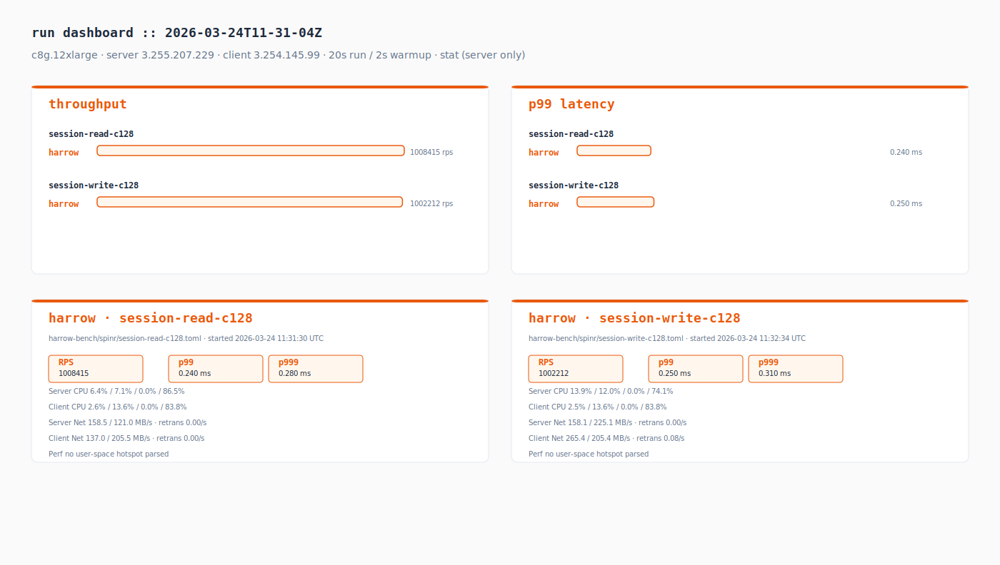
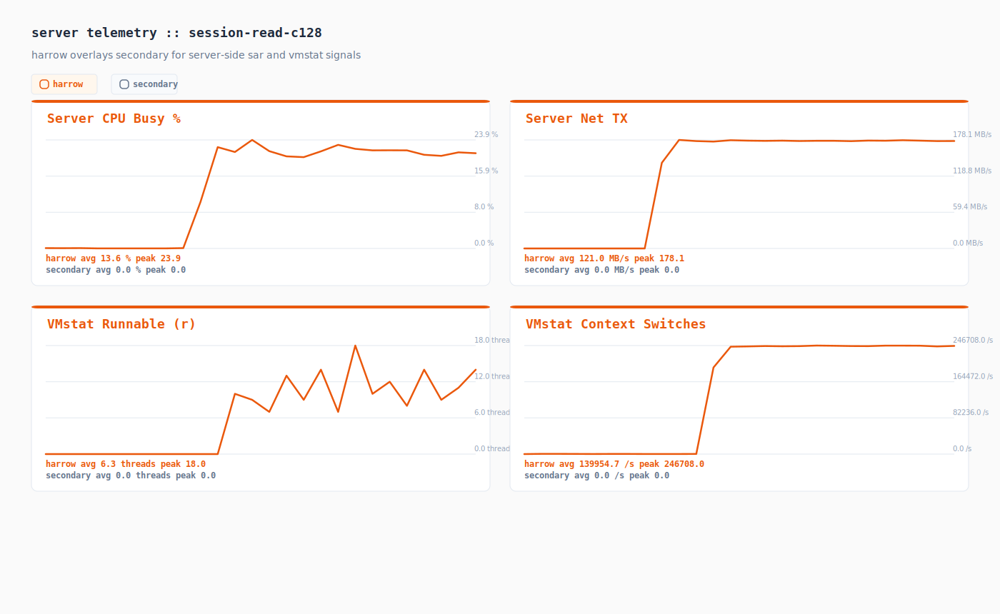
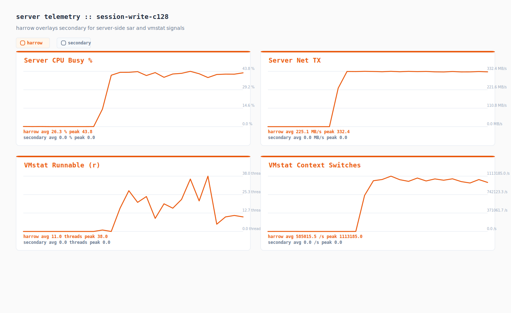

# Performance Test Results

Instance: c8g.12xlarge
Server: 3.255.207.229
Client: 3.254.145.99
Duration: 20s | Warmup: 2s
Spinr mode: docker
OS monitors: true
Perf: stat (server only)
Date: 2026-03-24 11:32:57 UTC

## Runs

| Test case | Framework | Path | Concurrency | RPS | p50 (ms) | p99 (ms) | p999 (ms) |
|-----------|-----------|------|-------------|-----|----------|----------|-----------|
| session-read-c128 | harrow | harrow-bench/spinr/session-read-c128.toml | 128 | 1008414.550 | 0.120 | 0.240 | 0.280 |
| session-write-c128 | harrow | harrow-bench/spinr/session-write-c128.toml | 128 | 1002212.250 | 0.120 | 0.250 | 0.310 |

## Comparison

| Test case | harrow RPS | secondary RPS | Delta % | harrow p99 (ms) | secondary p99 (ms) |
|-----------|------------|----------|---------|------------------|---------------|
| session-read-c128 | 1008414.550 | - | +0.00% | 0.240 | - |
| session-write-c128 | 1002212.250 | - | +0.00% | 0.250 | - |

## Telemetry Digest

| Run | Server CPU (user/sys/wait/idle) | Client CPU (user/sys/wait/idle) | Server Net (rx/tx MB/s, retrans/s) | Client Net (rx/tx MB/s, retrans/s) | Top Perf Hotspot |
|-----|----------------------------------|----------------------------------|------------------------------------|------------------------------------|------------------|
| harrow_session-read-c128 | 6.4% / 7.1% / 0.0% / 86.5% | 2.6% / 13.6% / 0.0% / 83.8% | 158.5 / 121.0 MB/s · retrans 0.00/s | 137.0 / 205.5 MB/s · retrans 0.00/s | - |
| harrow_session-write-c128 | 13.9% / 12.0% / 0.0% / 74.1% | 2.5% / 13.6% / 0.0% / 83.8% | 158.1 / 225.1 MB/s · retrans 0.00/s | 265.4 / 205.4 MB/s · retrans 0.08/s | - |

## Telemetry Charts

### session-read-c128

### session-write-c128

## Artifacts

| Run | JSON | Perf Report | Perf Script | Perf SVG | Server CPU | Server Net | Client CPU | Client Net |
|-----|------|-------------|-------------|----------|------------|------------|------------|------------|
| harrow_session-read-c128 | [json](./harrow_session-read-c128.json) | [perf-report](./harrow_session-read-c128.server.perf-report.txt) | [perf-script](./harrow_session-read-c128.server.perf.script) | - | [server cpu](./harrow_session-read-c128.server.sar-u.txt) | [server net](./harrow_session-read-c128.server.sar-net.txt) | [client cpu](./harrow_session-read-c128.client.sar-u.txt) | [client net](./harrow_session-read-c128.client.sar-net.txt) |
| harrow_session-write-c128 | [json](./harrow_session-write-c128.json) | [perf-report](./harrow_session-write-c128.server.perf-report.txt) | [perf-script](./harrow_session-write-c128.server.perf.script) | - | [server cpu](./harrow_session-write-c128.server.sar-u.txt) | [server net](./harrow_session-write-c128.server.sar-net.txt) | [client cpu](./harrow_session-write-c128.client.sar-u.txt) | [client net](./harrow_session-write-c128.client.sar-net.txt) |
